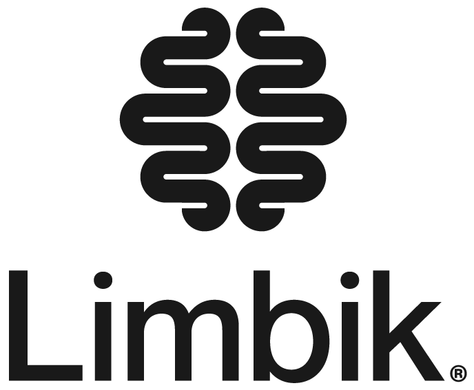

## Skills

Languages & Tools

Python
SQL
Docker
Kubernetes
Git
ArgoCD
Jenkins
Cypher/GraphQL
C++

Data

Postgres
Neo4j
AWS
Elastic
Apache Spark
Azure
Databricks

Machine Learning

PyTorch
HuggingFace
Scikit-Learn
Metaflow
TensorFlow

AI Engineering

LangChain
LlamaIndex
OpenAI
Anthropic
NVIDIA NIM
Weaviate
Pinecone

Soft Skills

Agile
Problem Analysis
JIRA
Confluence
Notion
ServiceNow
Trello

## Experience

Limbik

Data Scientist &nbsp;·&nbsp; Kitchener, ON &nbsp;·&nbsp; June 2022 – Present

Thomson Reuters

Machine Learning Intern &nbsp;·&nbsp; Toronto, ON &nbsp;·&nbsp; Sept 2021 – Dec 2021

Manulife

Data Engineer Co-op &nbsp;·&nbsp; Waterloo, ON &nbsp;·&nbsp; Jan 2021 – Apr 2021

KPMG

Data Engineer Co-op &nbsp;·&nbsp; Waterloo, ON &nbsp;·&nbsp; Jul 2020 – Aug 2020

RBC

Data Scientist Co-op &nbsp;·&nbsp; Toronto, ON &nbsp;·&nbsp; Sept 2019 – Dec 2019

## Education

University of Waterloo

BASc Management Engineering, Computing Option &nbsp;·&nbsp; 2017 – 2022

<a href="files/Gaurav_Web_Resume.pdf" class="btn btn-primary" target="_blank">View Resume PDF</a>

